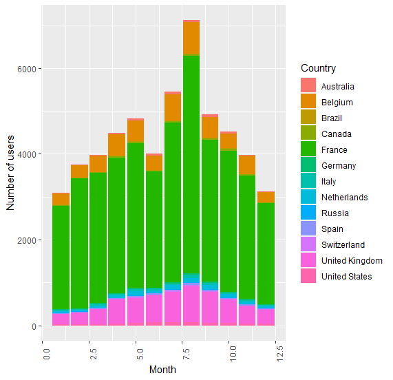
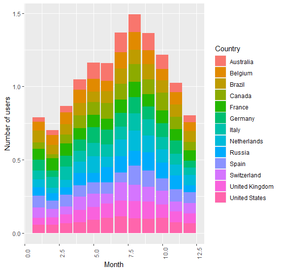
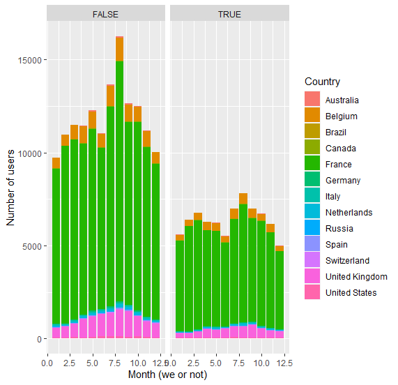
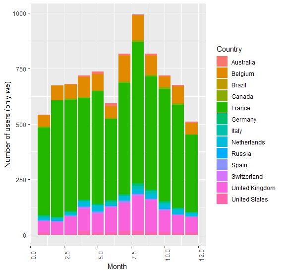
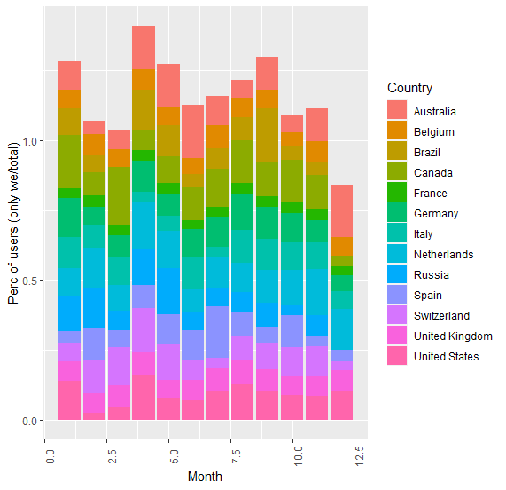
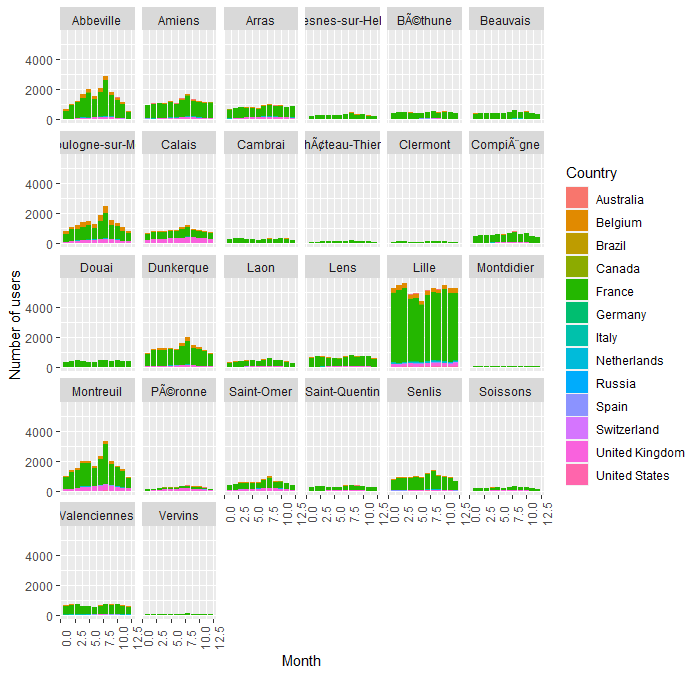
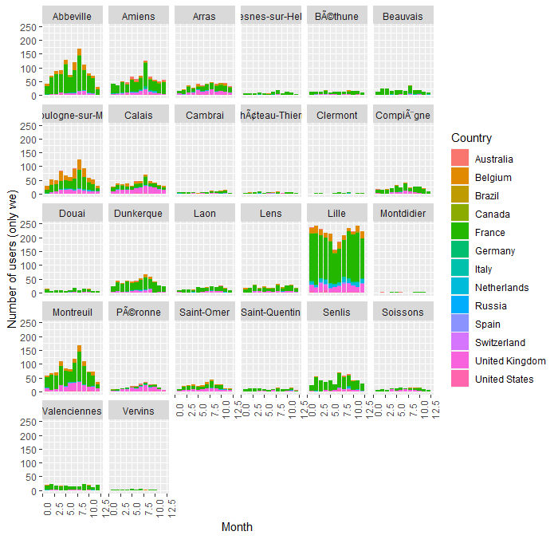

1. Number of users per nationality and per month (1 to 12)

2. Percent of users of each nationality per month (1 to 12)

3. Number of user per nationality which came on week days or week-end per month (1 to 12)

4. Number of user per nationality which came only on week-end per month (1 to 12)

5. Percent of user for each nationality which came only on week-end per month (1 to 12)

6. Number of users of eachnationality per month per GID (1 to 12)

6. Number of users of eachnationality per month per GID which came only on week-end(1 to 12)

