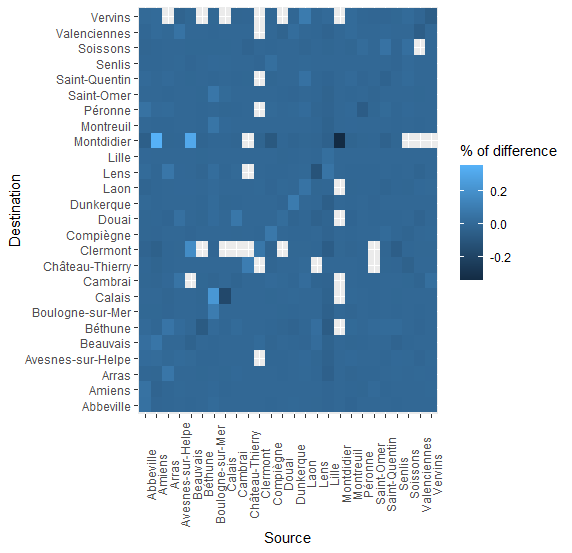
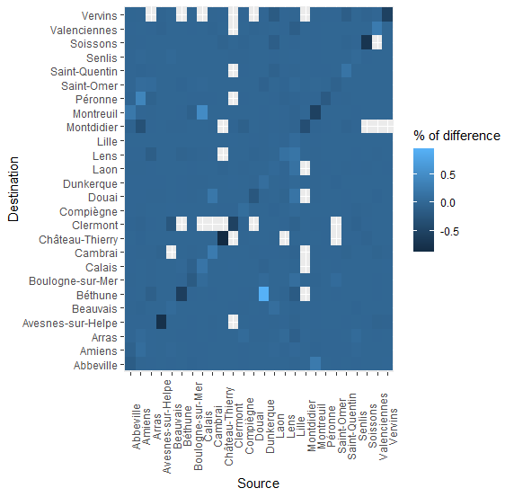
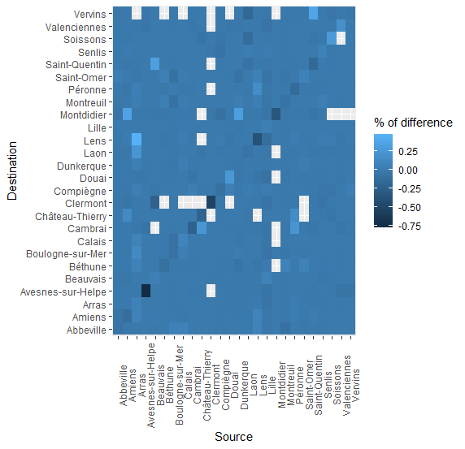
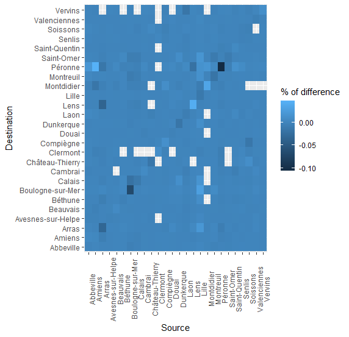
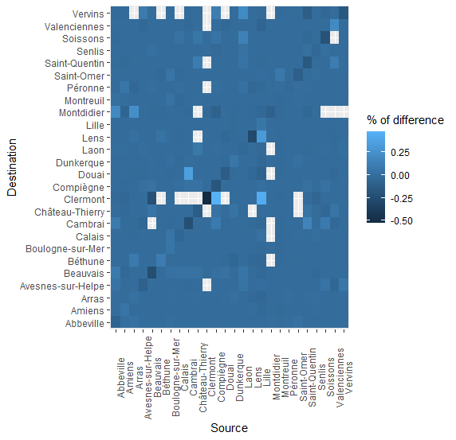
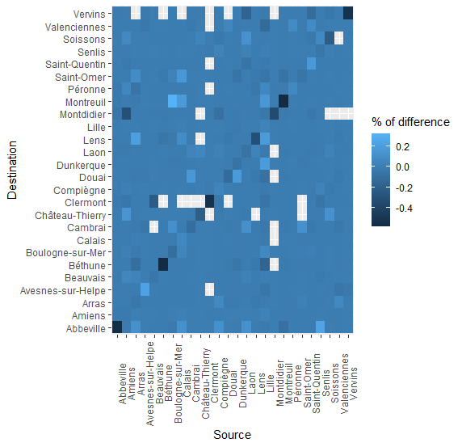
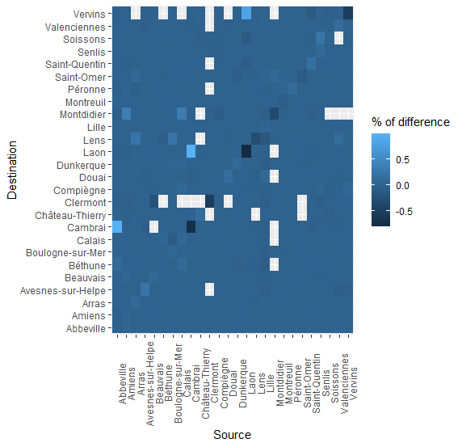
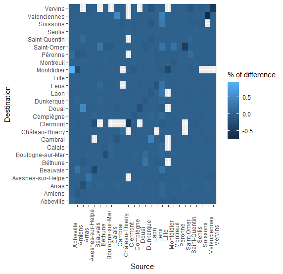
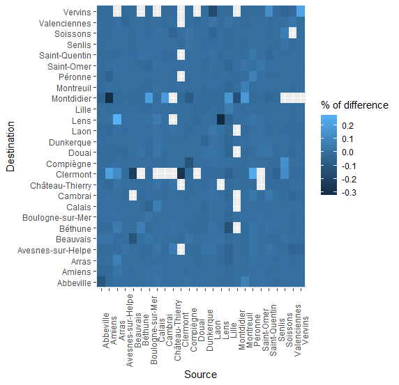

# Difference between inverted flows

The following graphics display the difference, in percent of incoming flow to area i from aera j, between a defined Nationality and the overall dataset.
| Nationality | Nb of flows | % of overall | Nb of user | % of overall | Nb of arcs |
|:-----------:|:-----------:|:------------:|:----------:|:------------:|:----------:|
|   Overall   |    177861   |      100     |    38851   |      100     |     645    |
|  Australia  |     1367    |      >1      |     374    |       1      |     127    |
|   Belgium   |    16617    |      9.3     |    4084    |     10.5     |     304    |
|    Brazil   |     632     |      >1      |     129    |      >1      |     66     |
|    Canada   |     989     |      >1      |     255    |      >1      |     122    |
|    France   |    129063   |     72.6     |    26325   |     67.7     |     627    |
|   Germany   |     909     |      >1      |     248    |      >1      |     111    |
|    Italy    |     1546    |       1      |     402    |       1      |     170    |
| Netherlands |     2784    |      1.6     |     709    |      1.8     |     188    |
|    Russia   |     877     |      >1      |     130    |      >1      |     113    |
|    Spain    |     848     |      >1      |     203    |      >1      |     108    |
| Switzerland |     659     |      >1      |     164    |      >1      |     98     |
|      UK     |    19528    |      11      |    5272    |     13.6     |     386    |
|     USA     |     2042    |      1.1     |     556    |      1.4     |     192    |
    
All value at 0 means that the flow don't exist for the selected dataset.

Diff-flow Australia       | Diff-flow Belgium       |
:-------------------------:|:-------------------------:|
  |   |

 Diff-flow Brazil       | Diff-flow Canada       |
:-------------------------:|:-------------------------:|
  |   |

Diff-flow France       | Diff-flow Germany       |
:-------------------------:|:-------------------------:|
  |   |

Diff-flow Italy       | Diff-flow Netherlands       |
:-------------------------:|:-------------------------:|
  |   |

Diff-flow Russia       | Diff-flow Spain       |
:-------------------------:|:-------------------------:|
  |   |

Diff-flow Switzerland       | Diff-flow UK       |
:-------------------------:|:-------------------------:|
  |   |

Diff-flow USA       |
:-------------------------:|
  | 

