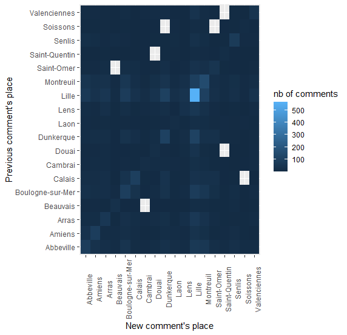

# Repeters

Repeter denotes a user who come back another year : based on 500299 observations.
Some stats before the graphics about the source and destination of repeters (far below).

| Year | Unique users | Unique name3-user | name3/user min | max | mean |  std |
|:----:|:------------:|:-----------------:|:--------------:|:---:|:----:|:----:|
| 2013 |     7931     |       11385       |        1       |  14 | 1.44 | 0.89 |
| 2014 |     13489    |       19731       |        1       |  15 | 1.46 |  0.9 |
| 2015 |     19751    |       30453       |        1       |  15 | 1.54 | 1.02 |
| 2016 |     24116    |       37909       |        1       |  16 | 1.57 | 1.06 |
| 2017 |     22896    |       36191       |        1       |  18 | 1.58 | 1.06 |
| 2018 |     19244    |       29800       |        1       |  18 | 1.58 | 1.03 |
| 2019 |     6573     |        8123       |        1       |  8  | 1.23 | 0.59 |
    
|   Year  | Unique users | % new year | Unique name3-user | name3/user min | max | mean |  std |
|:-------:|:------------:|:-----------------:|:-----------------:|:--------------:|:---:|:----:|:----:|
| 2013-14 |     4503     |        44       |        7177       |        1       |  13 | 1.59 | 1.05 |
| 2013-15 |     4166     |        41       |        6896       |        1       |  13 | 1.65 | 1.18 |
| 2013-16 |     3696     |        36       |        6167       |        1       |  13 | 1.67 | 1.15 |
| 2013-17 |     3024     |        30       |        5007       |        1       |  13 | 1.65 | 1.15 |
| 2013-18 |     2497     |        24       |        4052       |        1       |  14 | 1.62 | 1.13 |
| 2013-19 |      836     |        8       |        1071       |        1       |  8  | 1.28 | 0.69 |

|   Year  | Unique users | % new year | Unique name3-user | name3/user min | max | mean |  std |
|:-------:|:------------:|:----------:|:-----------------:|:--------------:|:---:|:----:|:----:|
| 2014-15 |     8026     |     48     |       13401       |        1       |  14 | 1.67 | 1.17 |
| 2014-16 |     6902     |     42     |       11516       |        1       |  16 | 1.67 | 1.17 |
| 2014-17 |     5525     |     33     |        9159       |        1       |  15 | 1.66 | 1.16 |
| 2014-18 |     4444     |     27     |        7166       |        1       |  14 | 1.61 | 1.13 |
| 2014-19 |     1508     |      9     |        1909       |        1       |  8  | 1.27 | 0.63 |

|   Year  | Unique users | % new year | Unique name3-user | name3/user min | max | mean |  std |
|:-------:|:------------:|:----------:|:-----------------:|:--------------:|:---:|:----:|:----:|
| 2015-16 |     11967    |     49     |       20083       |        1       |  16 | 1.67 | 1.15 |
| 2015-17 |     9254     |     37     |       15419       |        1       |  18 | 1.67 | 1.16 |
| 2015-18 |     7280     |     30     |       11668       |        1       |  15 | 1.60 | 1.11 |
| 2015-19 |     2366     |      9     |        2987       |        1       |  8  | 1.26 | 0.64 |

|   Year  | Unique users | % new year | Unique name3-user | name3/user min | max | mean |  std |
|:-------:|:------------:|:----------:|:-----------------:|:--------------:|:---:|:----:|:----:|
| 2016-17 |     13924    |     46     |       23297       |        1       |  18 | 1.67 | 1.17 |
| 2016-18 |     10479    |     35     |       16816       |        1       |  14 | 1.60 | 1.10 |
| 2016-19 |     3405     |     11     |        4294       |        1       |  8  | 1.26 | 0.62 |

|   Year  | Unique users | % new year | Unique name3-user | name3/user min | max | mean |  std |
|:-------:|:------------:|:----------:|:-----------------:|:--------------:|:---:|:----:|:----:|
| 2017-18 |     12255    |     44     |       20200       |        1       |  14 | 1.65 | 1.13 |
| 2017-19 |     4059     |     15     |        5125       |        1       |  8  | 1.26 | 0.63 |

|   Year  | Unique users | % new year | Unique name3-user | name3/user min | max | mean |  std |
|:-------:|:------------:|:----------:|:-----------------:|:--------------:|:---:|:----:|:----:|
| 2018-19 |     4680     |     20     |        5959       |        1       |  8  | 1.27 | 0.64 |

Repeters by percent of users from the first date        |
:-------------------------:|
  | 

# Repeters in number of visited aeras

## Repeters (consecutive)

Repeters 2013-2014             |  Repeters 2014-2015
:-------------------------:|:-------------------------:
  |  

Repeters 2015-2016             |  Repeters 2016-2017
:-------------------------:|:-------------------------:
  |  

Repeters 2017-2018             |  Repeters 2018-2019
:-------------------------:|:-------------------------:
  |  

## Repeters (non consecutive - first visit in 2013)

Repeters 2013-2015             |  Repeters 2013-2016
:-------------------------:|:-------------------------:
  |  

Repeters 2013-2017             |  Repeters 2013-2018
:-------------------------:|:-------------------------:
  |  

Repeters 2013-2019             |
:-------------------------:|
  | 

## Repeters (non consecutive - first visit in 2014)

Repeters 2014-2016             |  Repeters 2014-2017
:-------------------------:|:-------------------------:
  |  

Repeters 2014-2018             |  Repeters 2014-2019
:-------------------------:|:-------------------------:
  |  

## Repeters (non consecutive - first visit in 2015)

Repeters 2015-2017             |  Repeters 2015-2018
:-------------------------:|:-------------------------:
  |  

Repeters 2015-2019             |  
:-------------------------:|
  |  

## Repeters (non consecutive - first visit in 2016)

Repeters 2016-2018             |  Repeters 2016-2019
:-------------------------:|:-------------------------:
  |  

## Repeters (non consecutive - first visit in 2017)

Repeters 2017-2019             |  
:-------------------------:|
  |  

# Repeters in percent from the previous visited places 

## Repeters (consecutive)

Repeters 2013-2014             |  Repeters 2014-2015
:-------------------------:|:-------------------------:
  |  

Repeters 2015-2016             |  Repeters 2016-2017
:-------------------------:|:-------------------------:
  |  

Repeters 2017-2018             |  Repeters 2018-2019
:-------------------------:|:-------------------------:
  |  

## Repeters (non consecutive - first visit in 2013)

Repeters 2013-2015             |  Repeters 2013-2016
:-------------------------:|:-------------------------:
  |  

Repeters 2013-2017             |  Repeters 2013-2018
:-------------------------:|:-------------------------:
  |  

Repeters 2013-2019             |
:-------------------------:|
  | 

## Repeters (non consecutive - first visit in 2014)

Repeters 2014-2016             |  Repeters 2014-2017
:-------------------------:|:-------------------------:
  |  

Repeters 2014-2018             |  Repeters 2014-2019
:-------------------------:|:-------------------------:
  |  

## Repeters (non consecutive - first visit in 2015)

Repeters 2015-2017             |  Repeters 2015-2018
:-------------------------:|:-------------------------:
  |  

Repeters 2015-2019             |  
:-------------------------:|
  |  

## Repeters (non consecutive - first visit in 2016)

Repeters 2016-2018             |  Repeters 2016-2019
:-------------------------:|:-------------------------:
  |  

## Repeters (non consecutive - first visit in 2017)

Repeters 2017-2019             |  
:-------------------------:|
  |  
