# Nationality of repeters

## Two consecutives years

2013-2014             |  2014-2015  
:-------------------------:|:-------------------------:
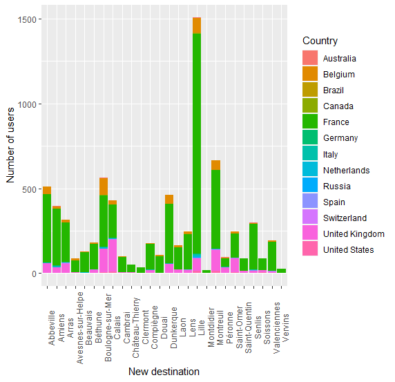  |  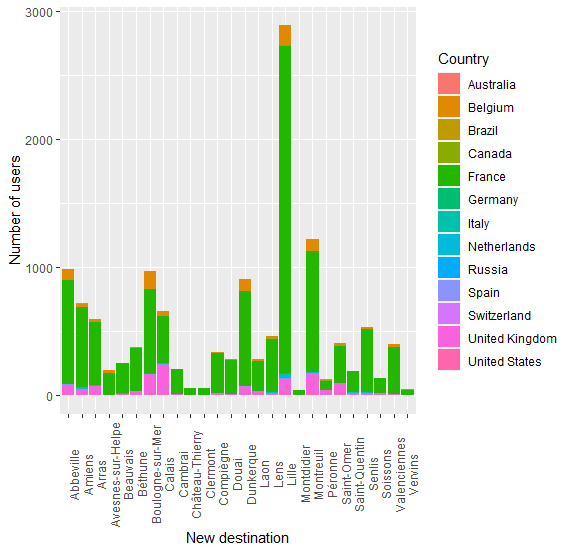

2015-2016               |  2016-2017  
:-------------------------:|:-------------------------:
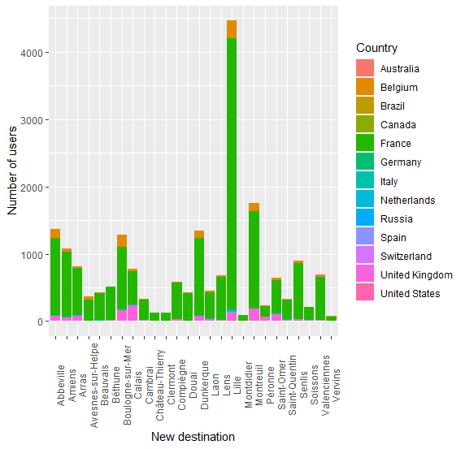  |  

2017-2018             |  2018-2019  
:-------------------------:|:-------------------------:
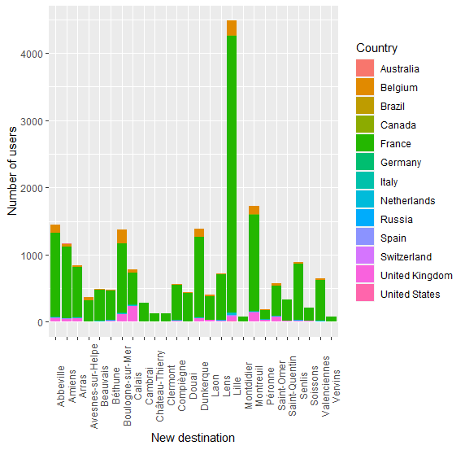  |  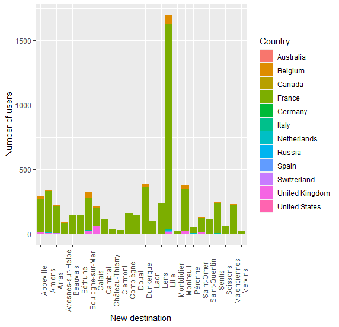

## Percents of tourists which are repeters by GID and by month

2017              | 
:-------------------------:|
  |  
 	

## Three consecutives years

2013 to 2015            |  2014 to 2016    
:-------------------------:|:-------------------------:
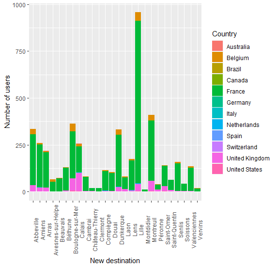  |  

2015 to 2017               | 2016 to 2018  
:-------------------------:|:-------------------------:
  |  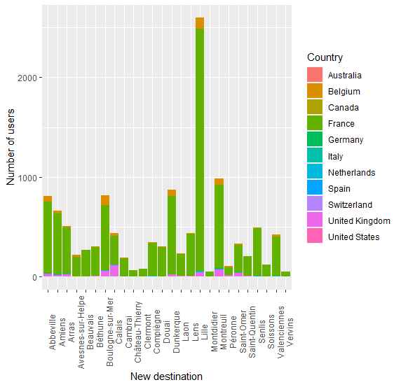

2017 to 2019              | 
:-------------------------:|
  |  

## Four consecutives years

2013 to 2016            |  2014 to 2017    
:-------------------------:|:-------------------------:
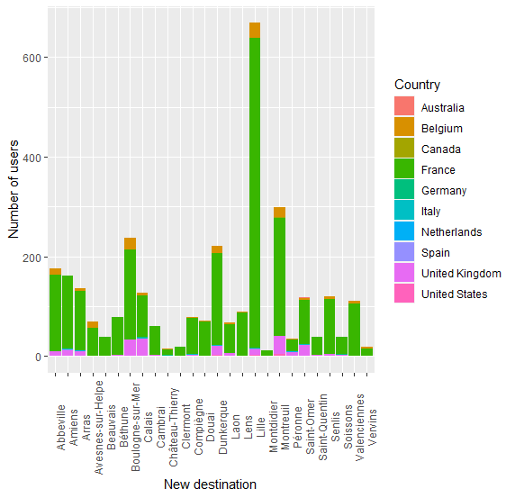  |  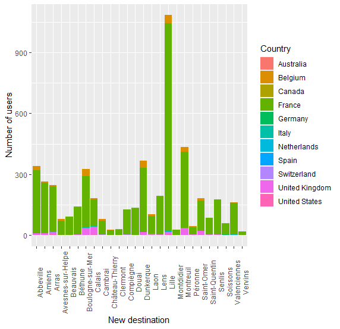

2015 to 2018               | 2016 to 2019  
:-------------------------:|:-------------------------:
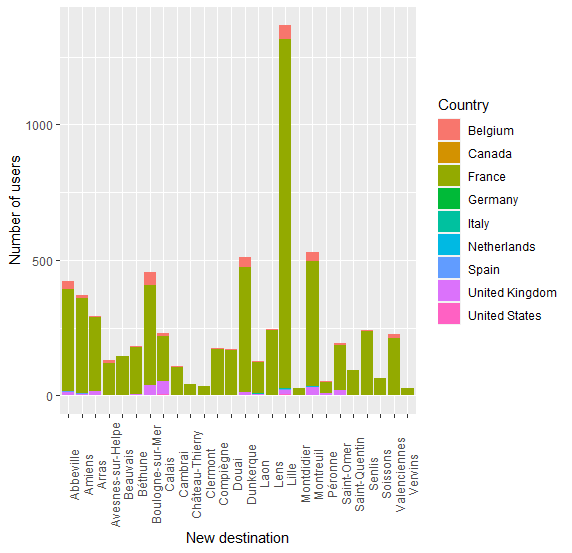  |  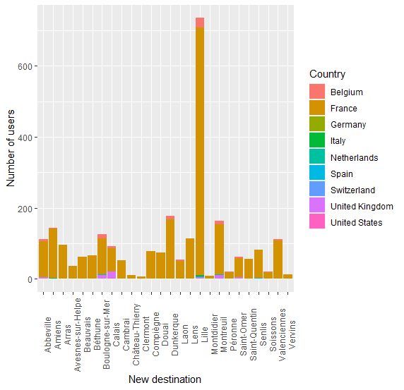

## Two consecutive years, based in GID

- For french tourists, repeters in 2017-2018

Amount of comments           | 
:-------------------------:|
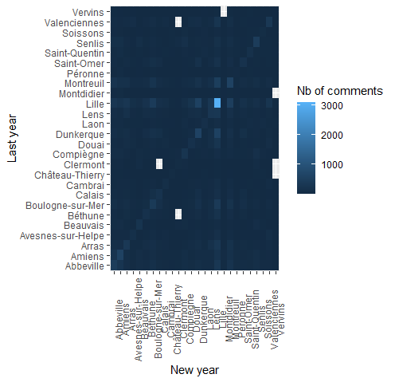  |

Outgoing flows              | Incoming flows 
:-------------------------:|:-------------------------:
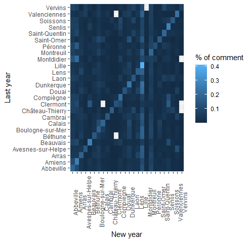  |  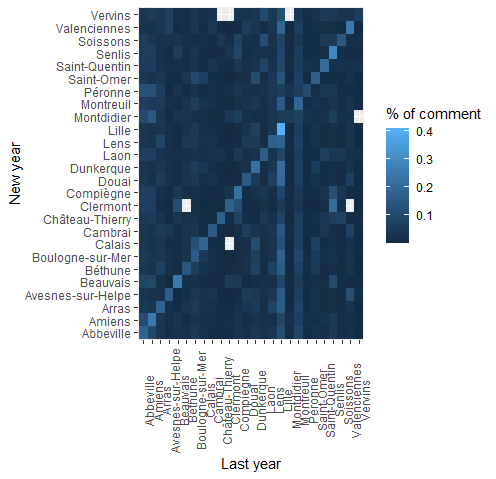

- For belgium tourists, repeters in 2017-2018

Amount of comments           | 
:-------------------------:|
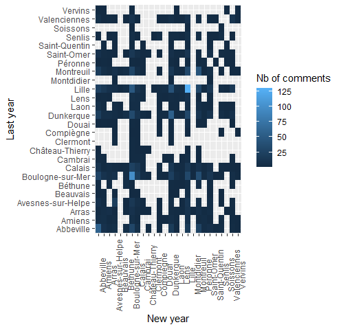  |

Outgoing flows              | Incoming flows 
:-------------------------:|:-------------------------:
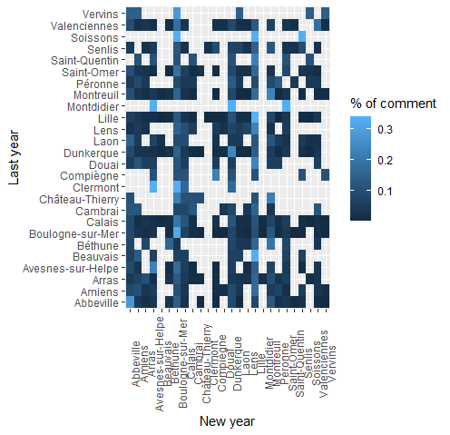  |  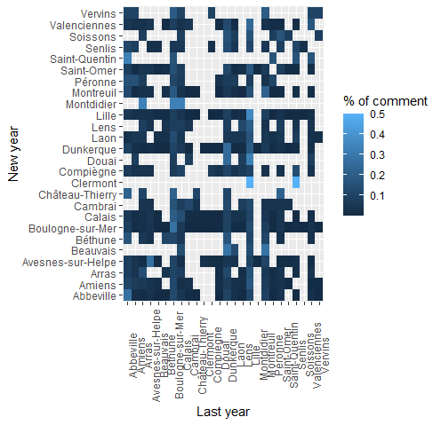

## Repeters during the same years

- Repeters during the same year per month and per nationality
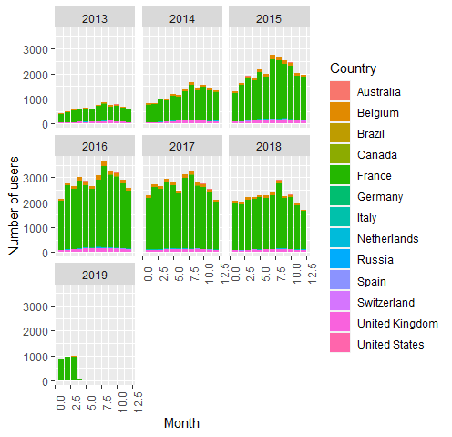 

- Repeters during the same year 2017 per month, per nationality and per GID
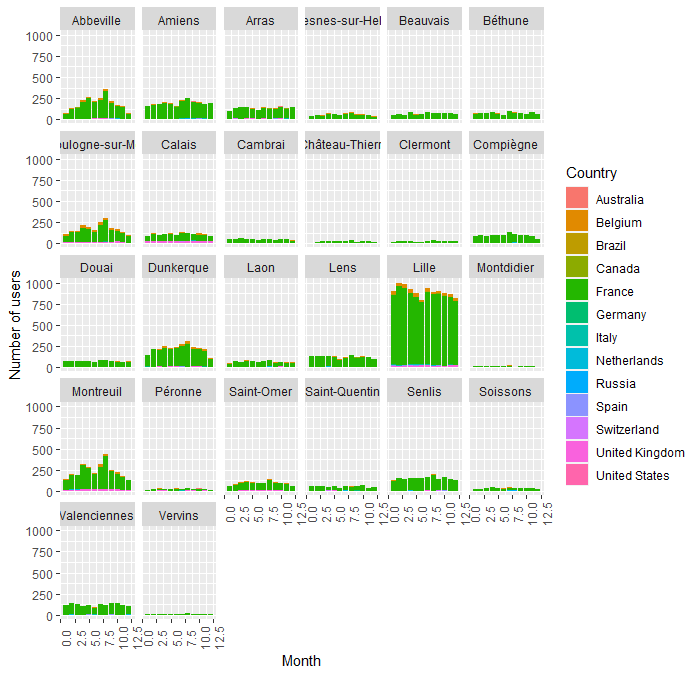 

