# Commuters analysis

Methods developped by Marianne Guérois & Laurent Beauguitte.

The statmat function provides for a source origin matrix a certain number of useful elements for knowing the initial data but also statistically justifying the method or the selected threshold. We obtain in particular the total volume of flows and the basic statistical indicators on these flows (quartiles, average, etc.), the density, the number, the size and the composition of the related components, the weighted and unweighted degree of the vertices. Graphical outputs are used to study the distribution of degrees (weighted and unweighted) and links (mustache box and Lorenz curve on the intensity of flows).

With regard to selection, three families of methods are implemented:

- classic dominant flows
- local criteria (for each summit, keep the flows satisfying such criteria)
- global criteria (considering all flows, keep those satisfying such criteria).

In our methods, we choose global criterion to analyse the most used paths.

- Flow selection from Origins: above the median
- DominantFlows selects which flow (fij or fji) must be kept. If the ratio weight of destination (wj) / weight of origin (wi) is greater than 1.

## Global commuters

1. Taking into account the whole dataset: 177861 flows (sum of all fij) from 38851 users

Statistics             |  Commuters at 5%
:-------------------------:|:-------------------------:
  |  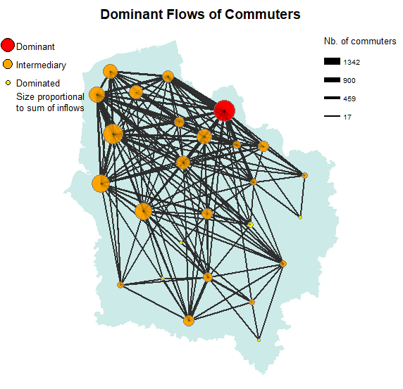

2. Taking into account comments by Australia's user: 1367 flows from 374 users

Statistics             |  Commuters at 5%
:-------------------------:|:-------------------------:
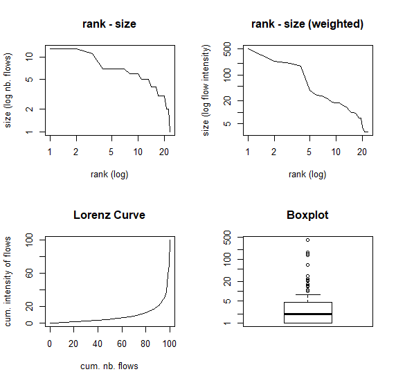  |  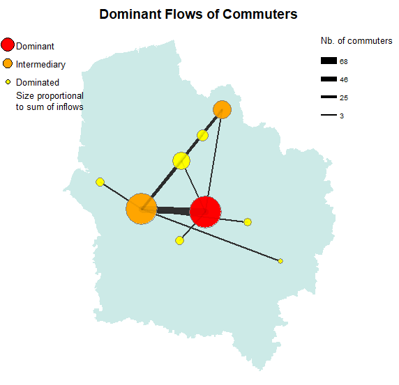

3. Taking into account comments by Belgium's user: 16617 flows from 4084 users

Statistics             |  Commuters at 5%
:-------------------------:|:-------------------------:
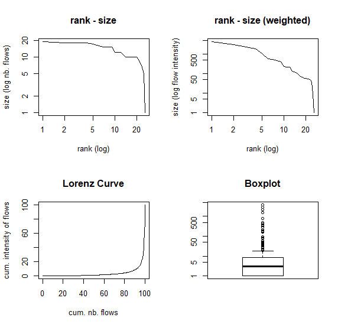  |  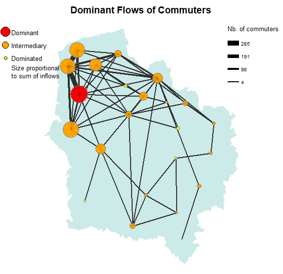

4. Taking into account comments by Brasil's user: 632 flows from 129 users

Statistics             |  Commuters at 5%
:-------------------------:|:-------------------------:
  |  No dominant flows.

5. Taking into account comments by Canada's user: 989 flows from 255 users

Statistics             |  Commuters at 5%
:-------------------------:|:-------------------------:
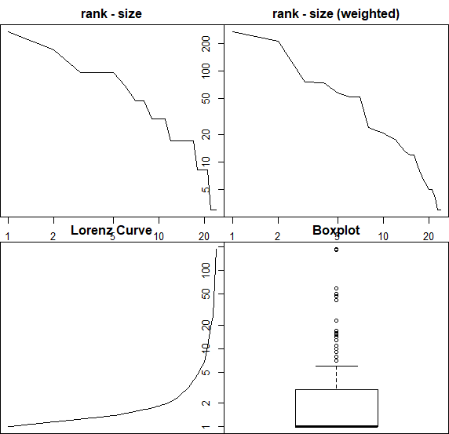  |  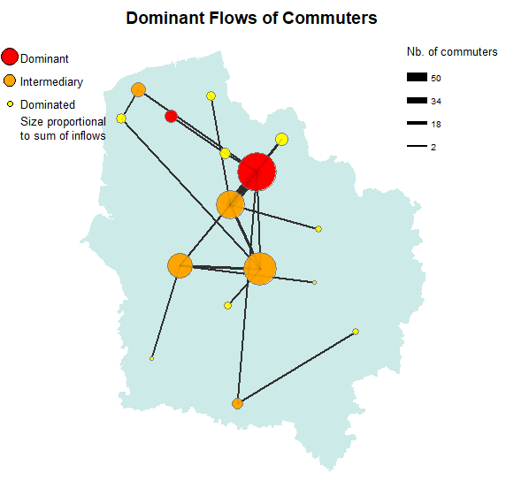

6. Taking into account comments by France's user: 129063 flows from 26325 users

Statistics             |  Commuters at 5%
:-------------------------:|:-------------------------:
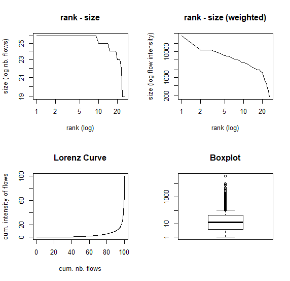  |  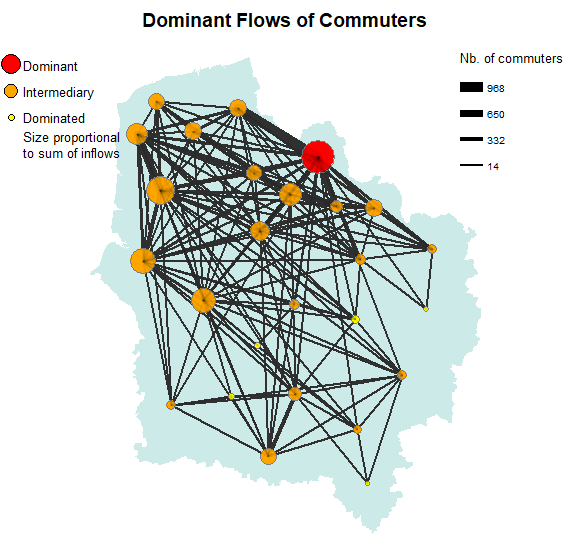

7. Taking into account comments by Germany's user: 909 flows from 248 users

Statistics             |  Commuters at 5%
:-------------------------:|:-------------------------:
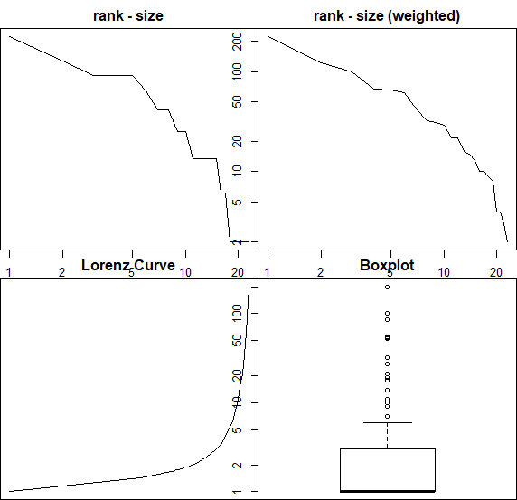  |  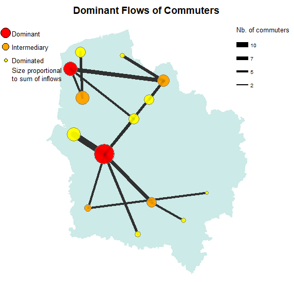

8. Taking into account comments by Italy's user: 1546 flows from 402 users

Statistics             |  Commuters at 5%
:-------------------------:|:-------------------------:
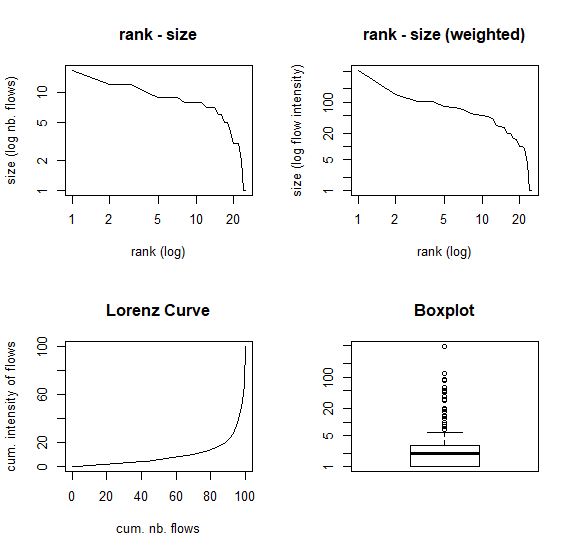  |  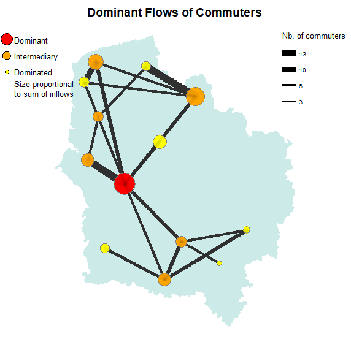

9. Taking into account comments by Netherlands's user: 2784 flows from 709 users

Statistics             |  Commuters at 5%
:-------------------------:|:-------------------------:
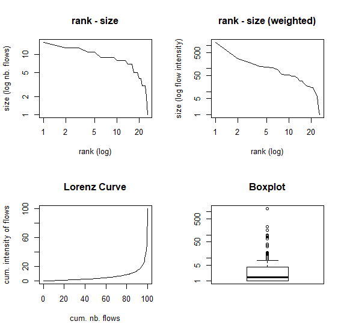  |  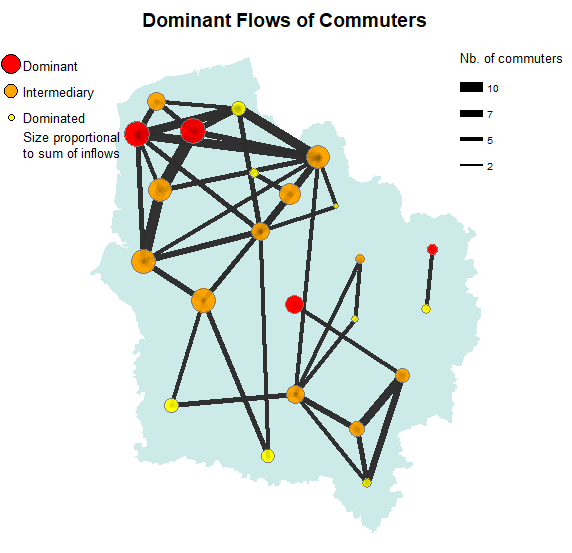

10. Taking into account comments by Russia's user:  877 flows from 130 users

Statistics             |  Commuters at 5%
:-------------------------:|:-------------------------:
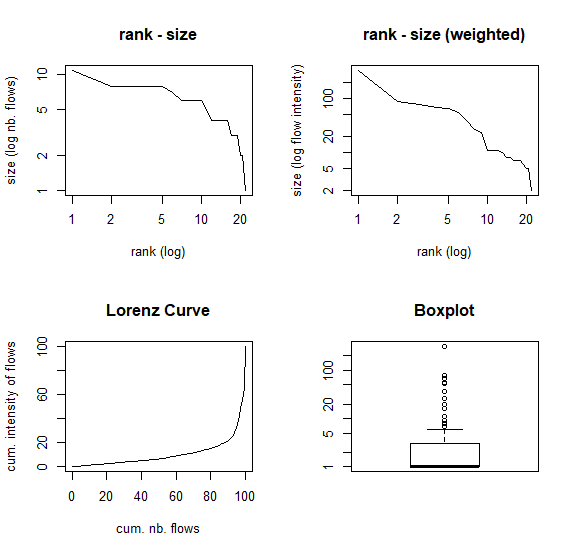  |  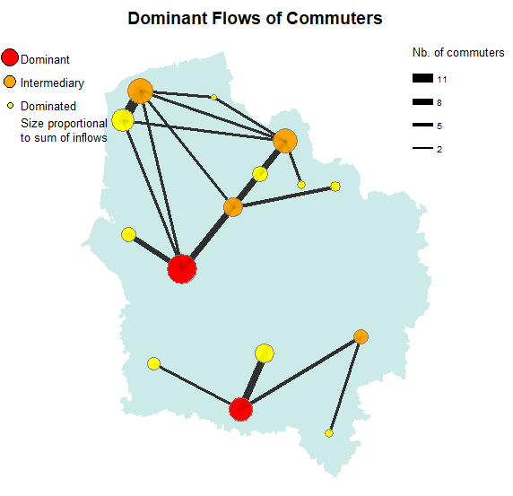

11. Taking into account comments by Spain's user: 848 flows from 203 users

Statistics             |  Commuters at 5%
:-------------------------:|:-------------------------:
  |  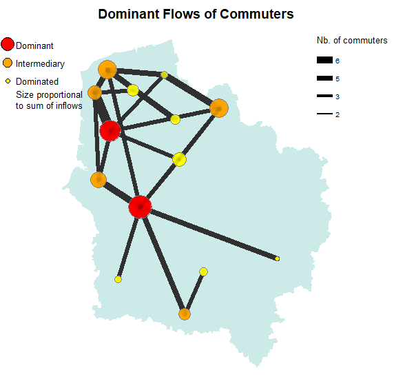

12. Taking into account comments by Switzerland's user: 659 flows from 164 users

Statistics             |  Commuters at 5%
:-------------------------:|:-------------------------:
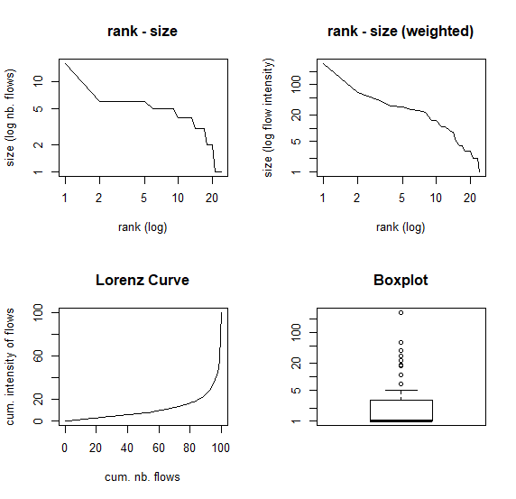  |  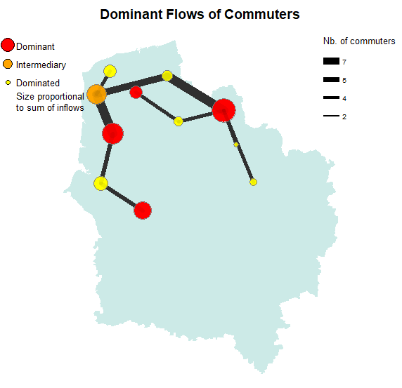

13. Taking into account comments by UK's user: 19528 flows from 5272 users

Statistics             |  Commuters at 5%
:-------------------------:|:-------------------------:
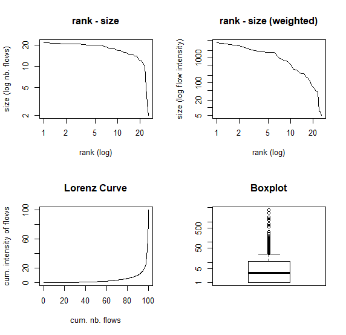  |  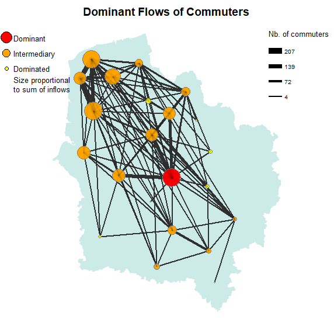

14. Taking into account comments by USA's user: 2042 flows from 556 users

Statistics             |  Commuters at 5%
:-------------------------:|:-------------------------:
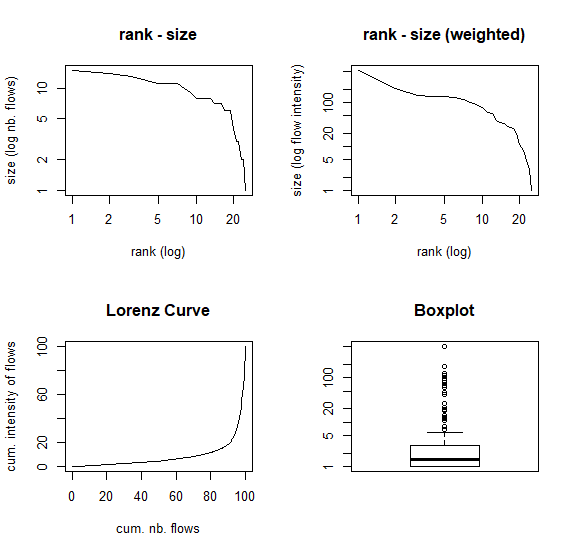  |  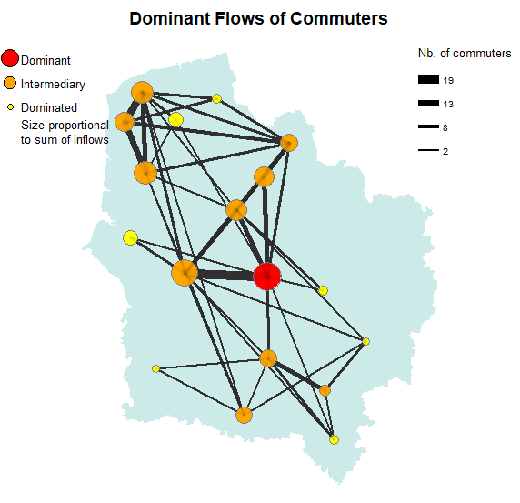
