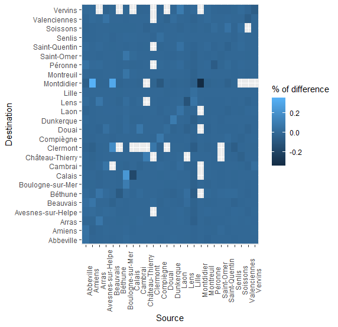
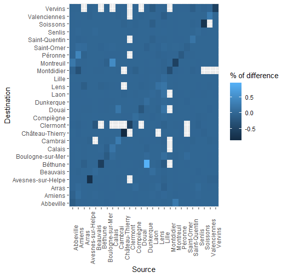
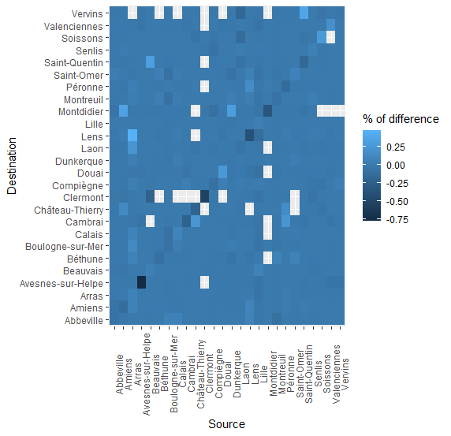
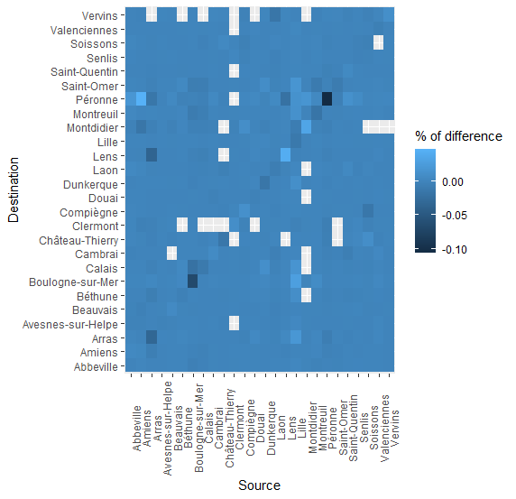
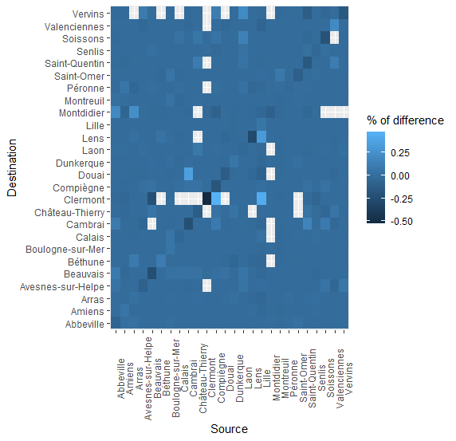
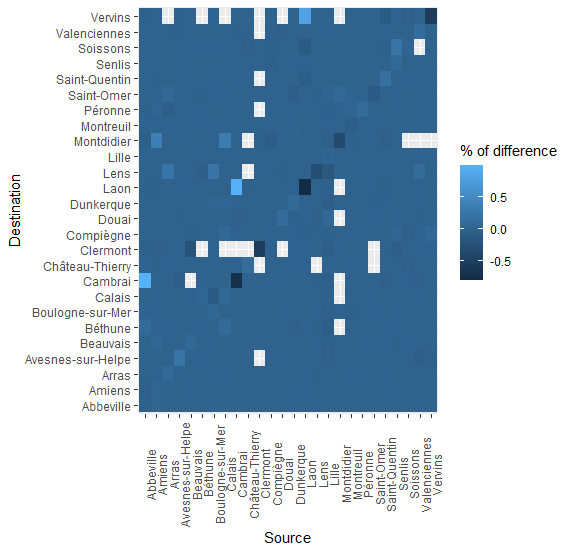
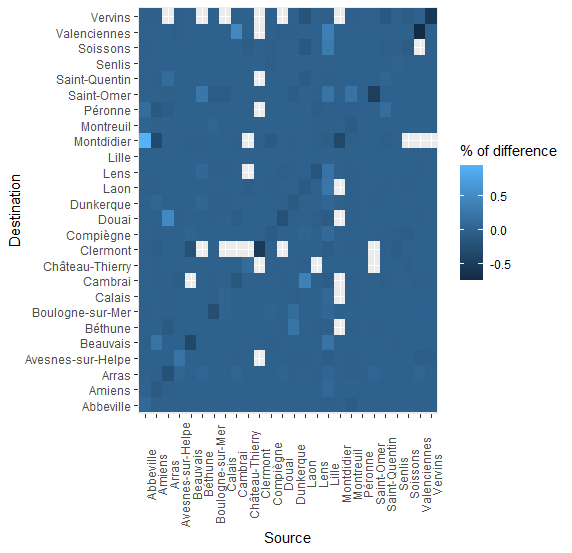
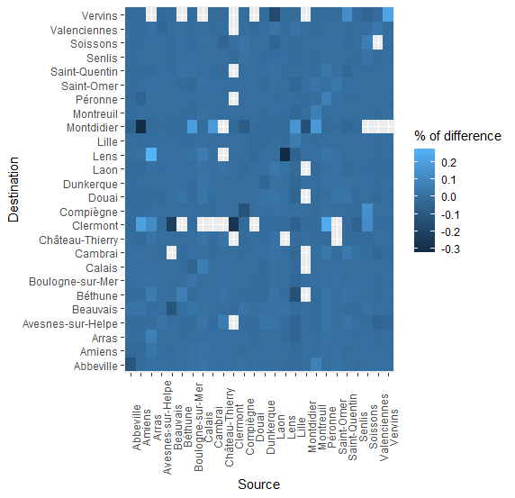

# Difference between inverted flows

The following graphics display the difference, in percent of incoming flow to area i from aera j, between a defined Nationality and the overall dataset.

Diff-flow Australia       | Diff-flow Belgium       |
:-------------------------:|:-------------------------:|
  |   |

 Diff-flow Brazil       | Diff-flow Canada       |
:-------------------------:|:-------------------------:|
  |   |

Diff-flow France       | Diff-flow Germany       |
:-------------------------:|:-------------------------:|
  |   |

Diff-flow Italy       | Diff-flow Netherlands       |
:-------------------------:|:-------------------------:|
  |   |

Diff-flow Russia       | Diff-flow Spain       |
:-------------------------:|:-------------------------:|
  |   |

Diff-flow Switzerland       | Diff-flow UK       |
:-------------------------:|:-------------------------:|
  |   |

Diff-flow USA       |
:-------------------------:|
  | 

